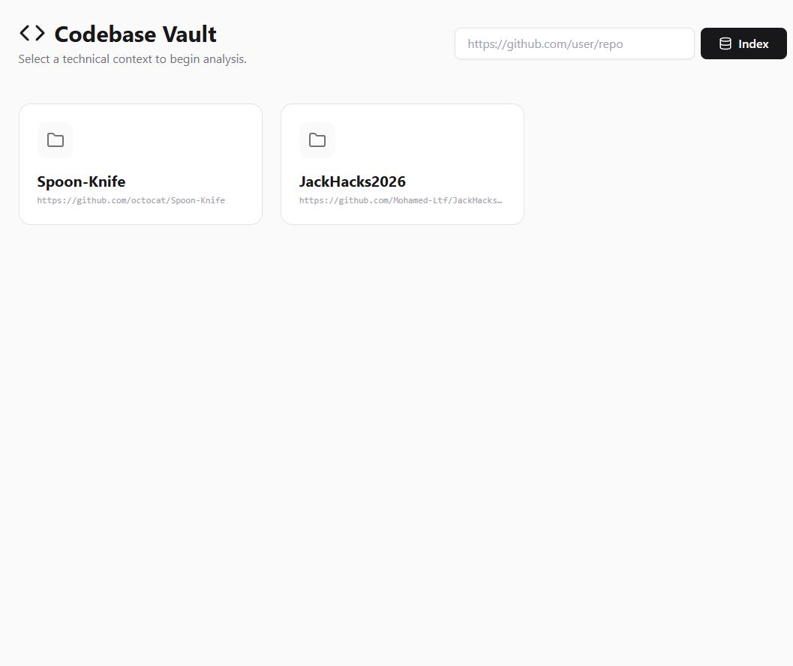
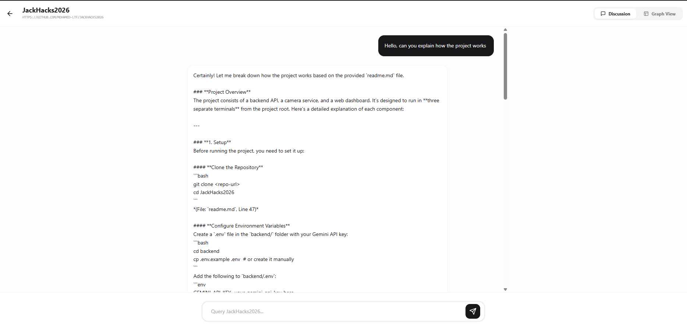
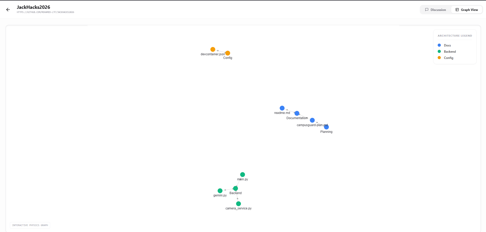

# Codebase Vault: Semantic Architecture Explorer

**Codebase Vault** is a technical intelligence tool that transforms flat GitHub repositories into interactive architectural maps. By leveraging **Cohere Embed-v3 for semantic retrieval** and **Command-A for high-level reasoning**, it allows developers to "chat" with their code and visualize logic through a physics-based graph.

**A centralized list of all indexed repositories.**

**Direct technical discussion with the codebase.**

**A visual map of system components and relationships.**

## The Tech Stack

| Layer | Technology | Purpose |
| :--- | :--- | :--- |
| **Frontend** | **Next.js 14 (App Router)** | Framework for a responsive, high-performance UI. |
| **Backend** | **FastAPI (Python)** | High-concurrency API handling ingestion and LLM orchestration. |
| **Vector DB** | **Pinecone** | Serverless vector database for semantic search. |
| **AI (Retrieval)** | **Cohere Embed-v3** | High-dimensional embeddings for precise code retrieval. |
| **AI (Reasoning)** | **Cohere Command-A** | Context-aware reasoning for technical chat and graph synthesis. |
| **Visualization** | **React Force Graph 2D** | D3-based canvas rendering for architectural relationships. |

---

## How It Works

### 1. Ingestion & Pre-processing
The backend utilizes `GitPython` to clone repositories. To ensure cross-platform compatibility (specifically for Windows systems), the system implements a **`remove_readonly`** handler to bypass permission locks on `.git` files during cleanup.

### 2. 10-Line Overlap Chunking
Files are filtered by extension and chunked into 50-line windows with a 40-line stride. This creates a **10-line overlap** between consecutive chunks, preserving semantic context that would otherwise be lost at hard boundaries.

### 3. Batched Upsert Strategy
To ensure reliability during large repository ingestions, the system processes vector upserts to Pinecone in **batches of 100**. This avoids payload size limits and ensures stable gRPC communication with the vector index.

---

## Architectural Trade-offs

### The "Zero-Vector" Retrieval Hack
To retrieve the file tree for the Graph View without the overhead of a secondary relational database, the system queries Pinecone using a **Zero-Vector** ($[0.0] * 1024$). This brute-force scraper allows the reconstruction of metadata for visualization within a single-DB architecture.

### LocalStorage & Statelessness
Repository tracking is handled via **LocalStorage** to maintain a stateless backend. While this limits data persistence to a single browser, it allowed the project to prioritize the AI RAG pipeline over user-management infrastructure.

---

## Getting Started

1. **Clone & Setup Backend:** 
   Install dependencies from `requirements.txt` and add your Cohere/Pinecone keys to `.env`. Run via `python main.py`.
2. **Setup Frontend:** 
   Run `npm install` and `npm run dev`.
